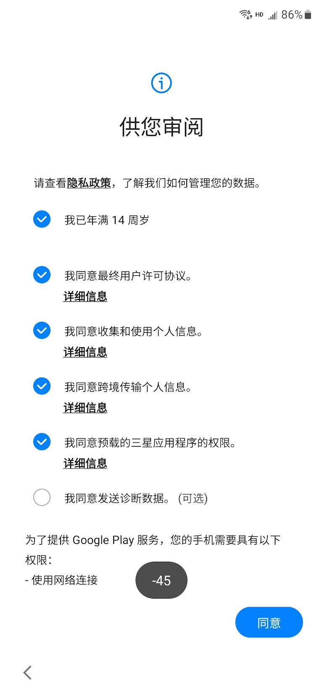
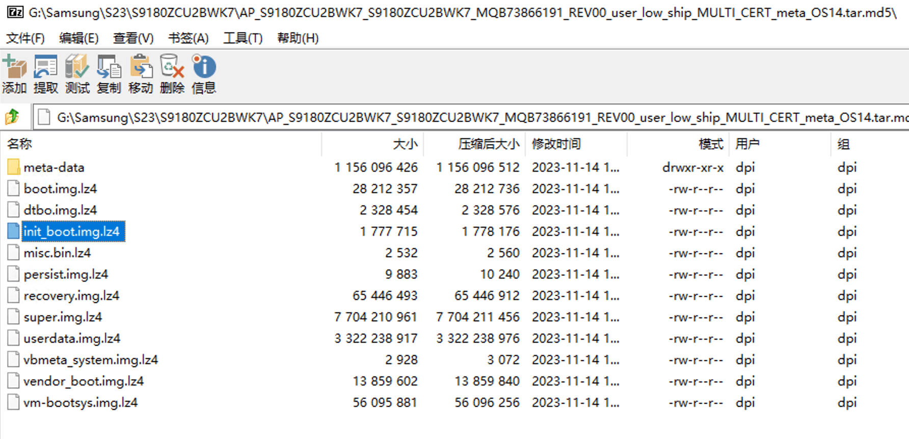
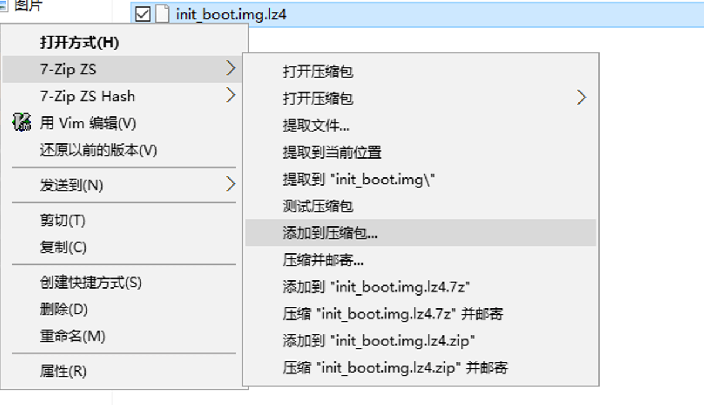
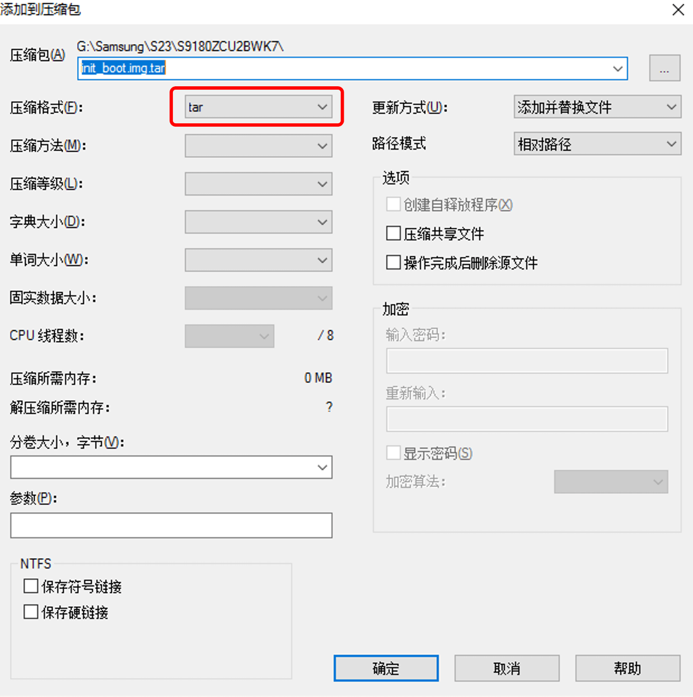
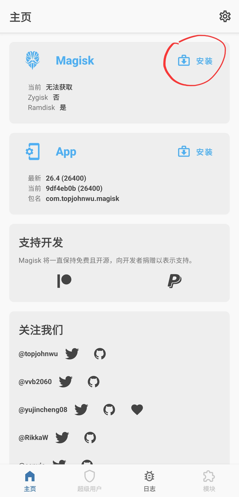
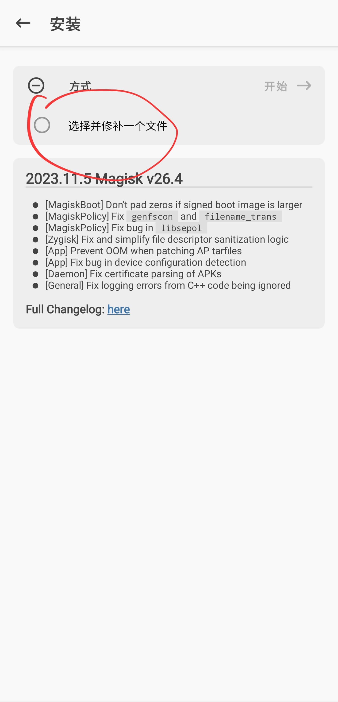
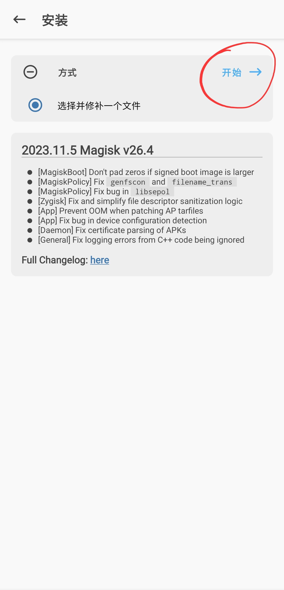
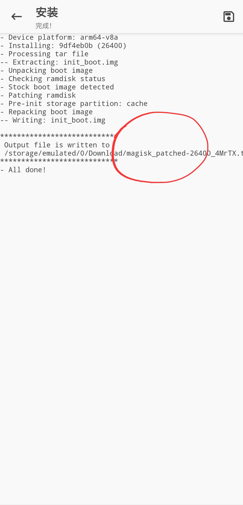
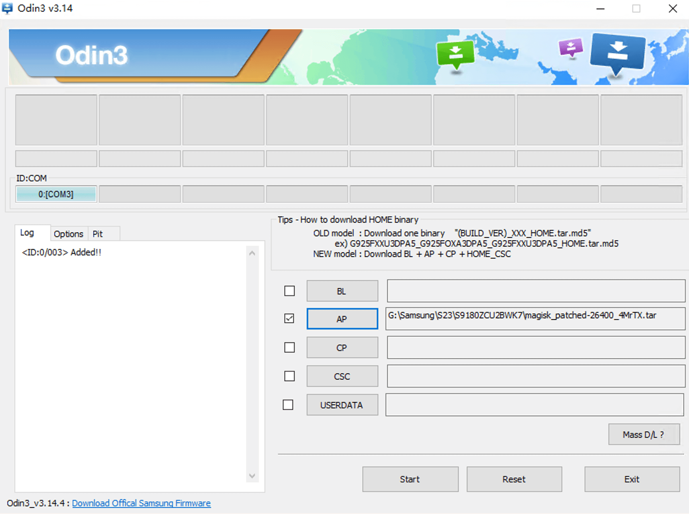

# 如何 Root 三星 S23 Ultra

目前主流的 Root 方式 [Magisk](https://github.com/topjohnwu/Magisk) 和 [KernelSU](https://github.com/tiann/KernelSU) 都支持三星 S23 系列。

_Root 前 Bootloader 的解锁以及解锁的风险不再赘述，不了解的请先查阅其他资料。_

这里主要介绍三星国行版本的 Root，国行版本比其他版本多了一个激活步骤，正常刷入 Magisk 或者 KernelSU 之后会卡在激活页面无法进入系统：

之前通过盲人键盘打开浏览器下载安装 Magisk 的方式，在最近的固件版本已被三星封锁，通过 WiFi 认证页面打开浏览器的方式过于繁琐。

这里介绍另一种方式：使用 [修改版 Magisk](https://github.com/fei-ke/Magisk/releases/latest) 进行 Root，这个修改版的 Magisk 屏蔽了三星激活的步骤，进入系统之后再刷回正式版本 Magisk 或 KernelSU

以下以三星 S9180ZCU2BWK7 OneUI 6 版本为例，详细介绍 Root 的步骤：

#### 1. 下载 [修改版 Magisk](https://github.com/fei-ke/Magisk/releases/latest) 并安装。

#### 2. 提取官方 ROM AP 中的 `init_boot.img.lz4`
> 提取工具可以使用 [7zip-zstd](https://github.com/mcmilk/7-Zip-zstd/releases/latest) (支持lz4)

#### 3. 将提取的 `init_boot.img.lz4` 打包为 tar 包

#### 4. 使用修改版的 Magisk 修补 init_boot.tar

#### 5. 使用 Odin 将修补后的 init_boot.tar 刷入手机
该过程会将手机数据清空，在操作前请注意备份，刷入重启后正常初始化手机，直到进入系统

#### 6. 将 Magisk 替换为官方版本
如果你希望使用 KernelSU 请跳过该步骤
> 由于修改版和官方版本签名不同，直接安装 magisk apk 会被自动卸载，需要将 apk 后缀改为 zip 从模块刷入，重启后再安装 Magisk apk

1. 安装步骤 1 中下载的 修改版 Magisk apk
2. 下载官方版本 [Magisk](https://github.com/topjohnwu/Magisk/releases/latest) （先不要安装）
3. 将下载的官方版本 Magisk .apk 后缀改为 .zip
4. 从 Magisk 的模块中将上一步的 Magisk zip 刷入
5. 重启手机后安装官方版本 Magsik apk 